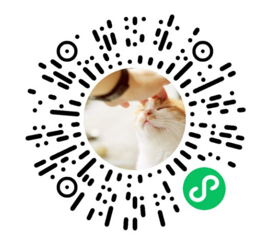
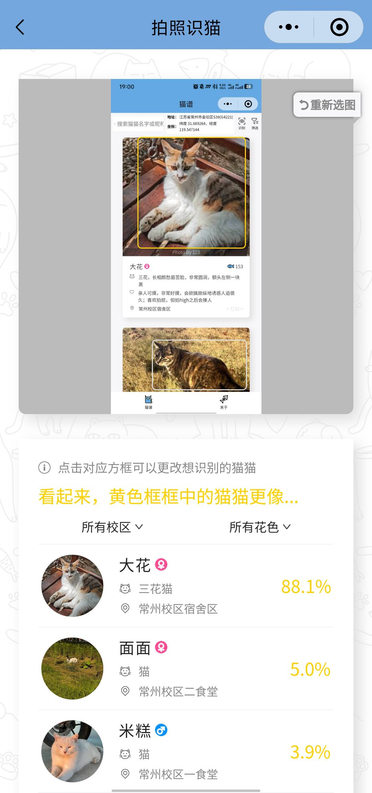
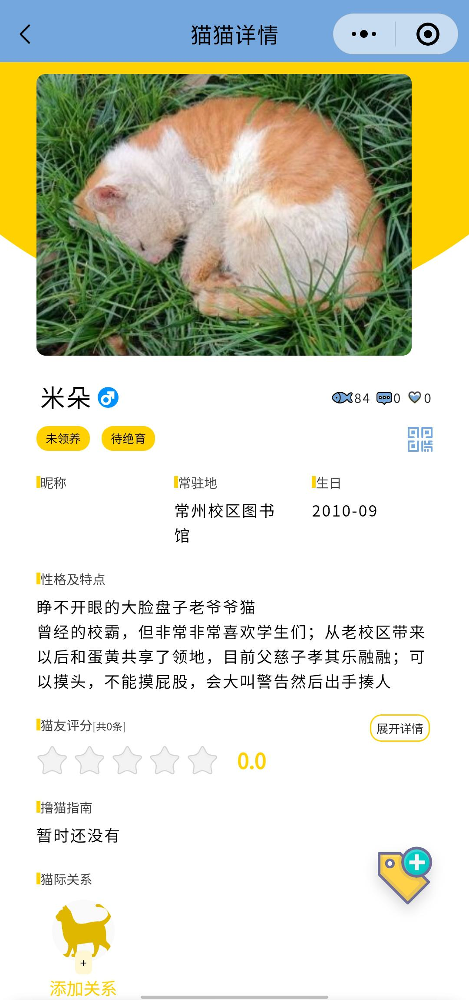
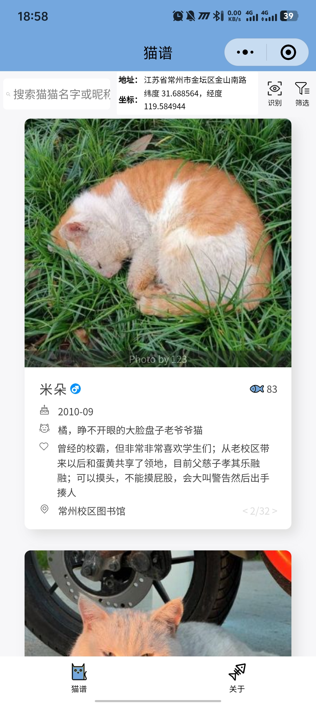
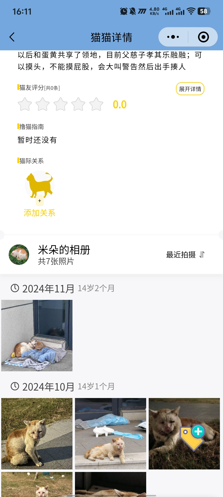

# 🐾 HHUCatAtlas：喵喵图鉴 🐾

**你的校园猫咪百科全书，基于微信小程序，带你探索校园喵星人的世界！** 😻

[](https://github.com/424635328/HHUCatAtlas)
[](https://github.com/424635328/HHUCatAtlas/issues)

**🚀 立即体验：扫码发现你的专属喵星人！**

<p align="center">
  
</p>

**✨ 项目愿景**

连接爱猫人士，轻松了解校园猫咪，打造充满活力的爱猫社区。

**🛠️ 技术栈**

*   **前端:** 微信小程序原生
*   **后端:** Node.js
*   **数据存储:** [laf.run](https://laf.run) (Serverless 云函数平台)

**🌟 核心功能**

**1. 🐱✨ 智能猫脸识别：一键识别，快速了解！**

告别手动搜索，上传照片，即刻识别猫咪身份，直达专属档案！

<p align="center">
  
  
</p>

**2. 🖼️ 精美猫咪图鉴：萌照一览，治愈你的心！**

清晰美观的猫咪列表，滑动浏览，发现你最爱的喵星人！

<p align="center">
  
</p>

**3. 📜 专属猫咪档案：深入了解，成为它们的专属铲屎官！**

高清照片、姓名、性别、性格、常出没地点、暖心故事，全方位了解你的喵伙伴！

<p align="center">
  
</p>
<p align="center">
  
</p>

**4. 💬 互动喵社区：分享你的爱，云吸猫不停！**

上传猫咪照片，分享趣事，点赞评论，结识更多爱猫人士，打造温馨社区！


**🗺️ 未来展望**

*   **更精准的识别:** 持续优化猫脸识别算法。
*   **更全面的图鉴:** 收录更多猫咪信息，打造最全百科。
*   **更活跃的社区:** 增强互动功能，提升用户体验。

**🤝 贡献指南**

欢迎提交 Issue 和 PR，分享猫咪照片和故事，共同完善喵喵图鉴！

**📄 代码贡献声明**

本项目部分代码参考 [sysucats/zhongdamaopu](https://github.com/sysucats/zhongdamaopu)，遵循 **Mozilla Public License Version 2.0** 许可证。

```
This Source Code Form is subject to the terms of the Mozilla Public
License, v. 2.0. If a copy of the MPL was not distributed with this
file, You can obtain one at http://mozilla.org/MPL/2.0/.
```

**📞 联系我们**

遇到问题？欢迎提交 Issue：[GitHub Issues](https://github.com/424635328/HHUCatAtlas/issues)

**🙏 鸣谢**

感谢所有贡献猫咪照片和信息的师生，以及可爱的喵星人们！

**📝 许可证**

本项目遵循 **Mozilla Public License Version 2.0** 许可证。 请查看 [LICENSE](LICENSE) 文件。