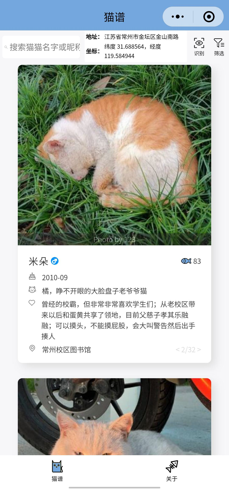

# 🐾 HHUCatAtlas：喵喵图鉴 🐾

**一款基于微信小程序的校园猫咪百科全书，带你探索喵星人的世界！** 😻

[](https://github.com/424635328/HHUCatAtlas)
[](https://github.com/424635328/HHUCatAtlas)
[](https://github.com/424635328/HHUCatAtlas/issues)
[](LICENSE)
[](https://github.com/424635328/HHUCatAtlas/pulls)
[](https://awesome.re)

**🚀 立即体验：扫码开启你的云吸猫之旅！**

<p align="center">
  
</p>


**✨ 项目愿景**

构建一个连接爱猫人士的平台，让了解校园猫咪变得轻松有趣，共同打造充满活力的爱猫社区。

**🛠️ 技术栈**

*   **前端:** 微信小程序原生
*   **后端:** Node.js
*   **数据存储 & 云函数:** [laf.run](https://laf.run) - Serverless 云开发平台 (一键部署，无需运维)
    [](https://laf.run)

**🌟 核心功能**

**1. 🐱✨ 智能猫脸识别：上传即识，快速了解猫咪身份！**

无需手动搜索，上传猫咪照片，即可快速识别猫咪身份，直达专属档案！

<p align="center">
  
  
</p>

**2. 🖼️ 精美猫咪图鉴：萌照一览，随时随地治愈你的心！**

清晰美观的猫咪列表，滑动浏览，发现你最爱的喵星人，尽情享受云吸猫的乐趣！

<p align="center">
  
</p>

**3. 📜 专属猫咪档案：深入了解，争当它们的专属铲屎官！**

高清照片、姓名、性别、性格、常出没地点、暖心故事… 全方位了解你的喵伙伴！

<p align="center">
  
  
</p>

**4. 💬 互动喵社区：分享猫咪趣事，结识更多爱猫人士！**

上传猫咪照片，分享趣事，点赞评论互动，结识更多志同道合的爱猫人士，共同打造温馨的猫咪社区！


**🗺️ 未来展望 (Roadmap)**

*   **更精准的识别:** 持续优化猫脸识别算法，提升识别准确率。
*   **更全面的图鉴:** 收录更多校园猫咪信息，打造最全的校园猫咪百科全书。
*   **更活跃的社区:** 增强社区互动功能，提升用户体验，增加更多趣味玩法。
*   **猫咪位置共享:**  实时更新猫咪位置，方便大家找到它们 (隐私保护)。
*   **领养/救助信息:**  发布领养/救助信息，帮助流浪猫找到温暖的家。

**🤝 贡献指南**


欢迎提交 Issue 和 PR，分享猫咪照片和故事，共同完善喵喵图鉴！

*   **提交 Issue:**  发现 Bug 或有新功能建议？欢迎提交 Issue！
    [GitHub Issues](https://github.com/424635328/HHUCatAtlas/issues)
*   **贡献代码:**  Fork 本项目，提交你的代码，一起完善喵喵图鉴！
    [GitHub Pull Requests](https://github.com/424635328/HHUCatAtlas/pulls)
*   **分享猫咪信息:**  分享你了解的校园猫咪信息，让图鉴更加完善！

**📄 代码贡献声明**

本项目部分代码参考 [sysucats/zhongdamaopu](https://github.com/sysucats/zhongdamaopu)，遵循 **Mozilla Public License Version 2.0** 许可证。

```
This Source Code Form is subject to the terms of the Mozilla Public
License, v. 2.0. If a copy of the MPL was not distributed with this
file, You can obtain one at http://mozilla.org/MPL/2.0/.
```

**📞 联系我们**


遇到问题？欢迎通过以下方式联系我们：

*   **GitHub Issues:** [GitHub Issues](https://github.com/424635328/HHUCatAtlas/issues)
*   **微信小程序:** 扫描上方二维码，加入喵喵图鉴官方微信群，与更多爱猫人士交流！

**🙏 鸣谢**


感谢所有贡献猫咪照片和信息的师生，以及可爱的喵星人们！

**📝 许可证**

本项目遵循 **Mozilla Public License Version 2.0** 许可证。 请查看 [LICENSE](LICENSE) 文件。