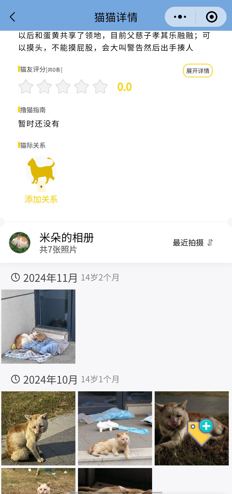

# HHUCatAtlas：华丽的喵星人图鉴 🐾

**用微信小程序探索河海大学的猫咪世界，体验智能猫脸识别！**

**项目愿景:**

*   打造一个集浏览、识别、分享于一体的校园猫咪信息平台，连接每一位爱猫人士。
*   让了解和认识河海大学的猫咪们变得更加轻松有趣。
*   构建一个充满活力的校园爱猫社区。

**技术栈:**

*   **前端:** 微信小程序原生开发
*   **后端:** Node.js
*   **数据存储:** laf.run (Serverless 云函数平台，轻量便捷)

**🌟 核心亮点:**

**1. 智能猫脸识别 🐱✨**

*   **告别手动输入！** 上传猫咪照片，小程序即可智能识别猫咪身份！
*   **一键直达！** 识别成功后，直接跳转至该猫咪的专属档案页。
*   **让认猫变得简单又有趣！**

  
  

**2. 精美猫咪图鉴 🖼️**

*   **萌照一览无余！** 清晰美观的猫咪列表，展示每只猫咪的可爱瞬间。
*   **滑动浏览，快速发现！** 轻松滑动即可浏览所有猫咪。

**3. 专属猫咪档案 📜**

*   **了解更多！** 详细的猫咪信息页面，包含高清照片、姓名、性别、性格、常出没地点，以及它们的故事。
*   **拉近距离！** 让你深入了解每一只可爱的猫咪。

**4. 互动喵社区 💬**

*   **分享你的猫咪故事！** 用户可以上传猫咪照片，分享与猫咪的趣事。
*   **点赞 & 评论！** 互动功能让社区更加活跃。

**🚀 项目状态:**

*   **在线运行中！** 欢迎扫码体验，与喵星人亲密接触！

**🗺️ 未来规划:**

*   **优化猫脸识别算法，** 持续提升识别准确率。
*   **丰富猫咪图鉴内容，** 收录更多校园猫咪。
*   **完善社区功能，** 增强用户互动体验。

**🤝 贡献方式:**

欢迎大家贡献代码、分享猫咪照片和故事，一起建设我们的喵星人图鉴！

**📞 联系方式:**

提交 Issue：[https://github.com/424635328/HHUCatAtlas/issues]

**🙏 特别鸣谢:**

感谢所有提供猫咪照片和信息的老师和同学们！  你们的贡献让这个项目更加精彩！